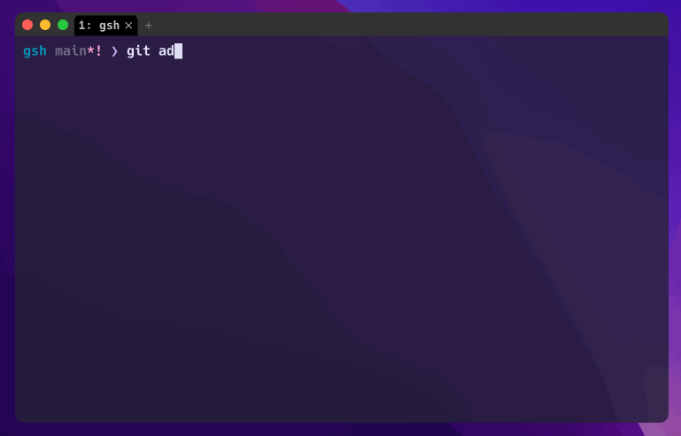
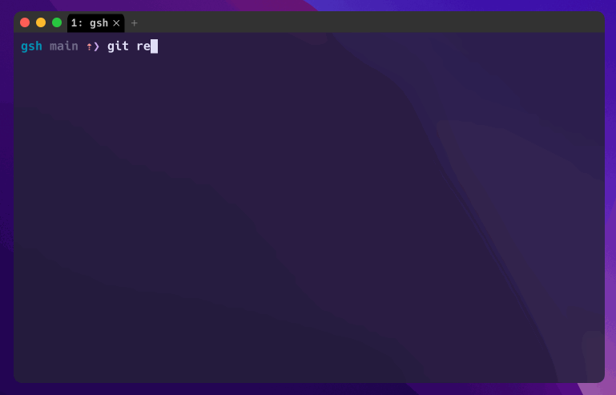
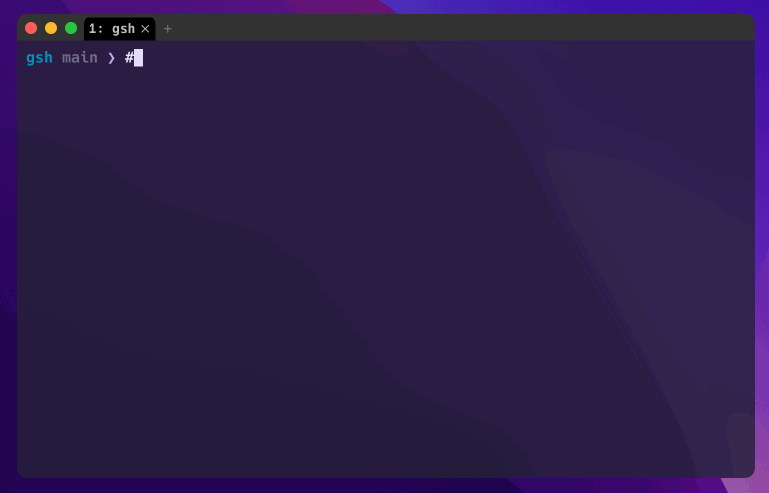

# gsh

[](https://github.com/atinylittleshell/gsh/actions)

A Modern, POSIX-compatible, Generative Shell.

## Status

This project is in early development stage. Use at your own risk!
Please expect bugs, incomplete features and breaking changes.

That said, if you can try it out and provide feedback,
that would help make gsh more useful!

## Main Features

gsh is a POSIX-compatible shell that leverages generative AI to provide
intelligent assistance to the user.

It is designed to be a drop-in replacement for bash or zsh,
with the following features:

### Generative suggestion of shell commands

gsh will automatically suggest the next command you are likely want to run.



### Command explanation

gsh will provide an explanation of the command you are about to run.



### Agent

gsh can act as an agent that invoke commands on your behalf.
Commands starting with "#" are sent to the agent as a chat message.


gsh can even code for you!



### Supports both local and remote LLMs

gsh can run with either

- Local LLMs through [Ollama](https://ollama.com/)
- Or remote LLMs through an OpenAI API-compatible endpoint, such as [OpenRouter](https://openrouter.ai/)

## Installation

To install gsh:

```bash
# Linux and macOS through Homebrew
brew tap atinylittleshell/gsh https://github.com/atinylittleshell/gsh
brew install atinylittleshell/gsh/gsh

# You can use gsh on arch, btw
yay -S gsh-bin
```

Windows is not supported (yet).

### Upgrading

gsh can automatically detect newer versions and self update.

## Configuration

gsh can be configured through a configuration file located at `~/.gshrc`.
Configuration options and default values can be found in [.gshrc.default](./.gshrc.default).

gsh also loads a `~/.gshenv` file, right after loading `~/.gshrc`.
This file can be used to set environment variables that the gsh session will use.

When launched as a login shell (`gsh -l`),
gsh will also load `/etc/profile` and `~/.gsh_profile` at start (before `~/.gshrc`).

### Custom command prompt

You can use [Starship.rs](https://starship.rs/) to render a custom command line prompt.
See [.gshrc.starship](./.gshrc.starship) for an example configuration.

## Usage

### Manually

You can manually start gsh from an existing shell:

```bash
gsh
```

### Automatically, through an existing shell

You can also automatically launch gsh from another shell's configuration file:

```bash
# For bash
echo "gsh" | tee -a ~/.bashrc
```

```bash
# For zsh
echo "gsh" | tee -a ~/.zshrc
```

### Automatically, as your default shell

Or, you can set gsh as your default shell.
This is not recommended at the moment as gsh is still in early development.
But if you know what you are doing, you can do so by:

```bash
# Get the absolute path to gsh by running `which gsh`
which gsh

# Add gsh to the list of approved shells
echo "/path/to/gsh" | sudo tee -a /etc/shells

# Change your default shell to gsh
chsh -s "/path/to/gsh"
```

## Default Key Bindings

gsh provides a set of default key bindings for navigating and editing text input.
These key bindings are designed to be familiar to users of traditional shells and text editors.
It's on the roadmap to allow users to customize these key bindings.

- **Character Forward**: `Right Arrow`, `Ctrl+F`
- **Character Backward**: `Left Arrow`, `Ctrl+B`
- **Word Forward**: `Alt+Right Arrow`, `Ctrl+Right Arrow`, `Alt+F`
- **Word Backward**: `Alt+Left Arrow`, `Ctrl+Left Arrow`, `Alt+B`
- **Delete Word Backward**: `Alt+Backspace`, `Ctrl+W`
- **Delete Word Forward**: `Alt+Delete`, `Alt+D`
- **Delete After Cursor**: `Ctrl+K`
- **Delete Before Cursor**: `Ctrl+U`
- **Delete Character Backward**: `Backspace`, `Ctrl+H`
- **Delete Character Forward**: `Delete`, `Ctrl+D`
- **Line Start**: `Home`, `Ctrl+A`
- **Line End**: `End`, `Ctrl+E`
- **Paste**: `Ctrl+V`

## Roadmap

See [ROADMAP.md](./ROADMAP.md) for what's already planned.
Feel free to suggest new features by opening an issue!

## Acknowledgements

gsh is built on top of many great open source projects. Most notably:

- [mvdan/sh](https://github.com/mvdan/sh) - A shell parser, formatter, and interpreter
- [bubbletea](https://github.com/charmbracelet/bubbletea) - A powerful little TUI framework
- [zap](https://github.com/uber-go/zap) - Blazing fast, structured, leveled logging in Go
- [gorm](https://github.com/go-gorm/gorm) - The fantastic ORM library for Golang
- [go-openai](https://github.com/sashabaranov/go-openai) - A Go client for the OpenAI API
